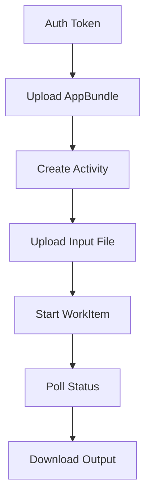

# 📬 APS Design Automation – Postman Flow Guide

This guide helps you configure and run **Autodesk Platform Services (APS) Design Automation v3** using **Postman**.

The objective is to demonstrate how to use a customized version of the predefined activity `AutoCAD.AcLMVExport+prod` through a step-by-step Postman flow. This includes uploading an AppBundle containing your custom business logic, which injects metadata—such as custom properties on AutoCAD objects like *Walls*—during the LMV extraction process.

In other words, the `createcolloboration` activity enables the generation of a specialized output format that LMV-based applications, such as Autodesk Construction Cloud (ACC), can directly consume. The resulting file from this flow can be seamlessly uploaded to ACC for downstream workflows.

---

## 📦 Prerequisites

- [ ] Autodesk Developer Account (https://aps.autodesk.com)
- [ ] App created with:
  - `Client ID`
  - `Client Secret`
- [ ] Postman installed (or Postman Web)

---

## 🧠 Terminology (from `DASettings.cs`)

| Variable       | Value                     | Purpose                                  |
| -------------- | ------------------------- | ---------------------------------------- |
| `OWNER`        | `adnworks`                | Namespace for app bundles and activities |
| `BUNDLENAME`   | `lmvextractor`            | Name of the Design Automation AppBundle  |
| `ACTIVITY`     | `createcolloboration`     | Activity name                            |
| `LABEL`        | `prod`                    | Version tag                              |
| `TARGETENGINE` | `Autodesk.AutoCAD+25_0`   | DA Engine                                |
| `CLBNAME`      | `House.collaboration`     | Output file name                         |
| `PACKAGENAME`  | `LMVExtractor.bundle.zip` | Zip file to upload for the app bundle    |

---

## 🔁 Flow Overview



⚙️ Step-by-Step in Postman
1️⃣ Get OAuth v2 Token (2-legged)
POST https://developer.api.autodesk.com/authentication/v2/token

Headers:

```bash
Content-Type: application/x-www-form-urlencoded
Body (x-www-form-urlencoded):
```

```ini
client_id={{APS_CLIENT_ID}}
client_secret={{APS_CLIENT_SECRET}}
grant_type=client_credentials
scope=data:read data:write bucket:create bucket:read bucket:update bucket:delete code:all
```

✅ Save the access_token as an environment variable ACCESS_TOKEN.

2️⃣ Upload AppBundle (Optional if already uploaded)
POST https://developer.api.autodesk.com/da/us-east/v3/appbundles

Headers:

```css
Authorization: Bearer {{ACCESS_TOKEN}}
Content-Type: application/json
```

Body:

```json
{
  "id": "lmvextractor",
  "engine": "Autodesk.AutoCAD+25_0",
  "description": "AutoCAD AppBundle for LMV extraction"
}
```

✅ Then upload your [LMVExtractor.bundle.zip](aps-acc-da/App_Data/LMVExtractor.bundle.zip) using multipart upload if needed.

3️⃣ Create Activity
POST https://developer.api.autodesk.com/da/us-east/v3/activities

Headers:

```css
Authorization: Bearer {{ACCESS_TOKEN}}
Content-Type: application/json
```

Body:

```json
{
  "id": "createcolloboration",
  "engine": "Autodesk.AutoCAD+25_0",
  "commandLine": [
    "$(engine.path)\\accoreconsole.exe /i \"$(args[inputFile].path)\" /al \"$(appbundles[lmvextractor].path)\" /s \"$(settings[script].path)\""
  ],
  "parameters": {
    "inputFile": {
      "description": "DWG input file",
      "required": true,
      "verb": "get"
    },
    "collaboration": {
      "description": "Output result file",
      "required": true,
      "verb": "put",
      "localName": "House.collaboration"
    }
  },
  "settings": {
    "script": {
      "value": "EXTRACTDATA\n"
    }
  },
  "appbundles": [
    "adnworks.lmvextractor+prod"
  ]
}
```

4️⃣ Upload Input File to OSS
PUT https://developer.api.autodesk.com/oss/v2/buckets/{{BUCKET_KEY}}/objects/{{OBJECT_KEY}}

Headers:

```css
Authorization: Bearer {{ACCESS_TOKEN}}
```

Upload your .dwg file as the input.

5️⃣ Start WorkItem
POST https://developer.api.autodesk.com/da/us-east/v3/workitems

Headers:

```css
Authorization: Bearer {{ACCESS_TOKEN}}
Content-Type: application/json
```

Body:

```json
{
  "activityId": "adnworks.createcolloboration+prod",
  "arguments": {
    "inputFile": {
      "url": "https://developer.api.autodesk.com/oss/v2/buckets/{{BUCKET_KEY}}/objects/{{INPUT_FILE}}",
      "headers": {
        "Authorization": "Bearer {{ACCESS_TOKEN}}"
      }
    },
    "collaboration": {
      "url": "https://developer.api.autodesk.com/oss/v2/buckets/{{BUCKET_KEY}}/objects/House.collaboration",
      "verb": "put",
      "headers": {
        "Authorization": "Bearer {{ACCESS_TOKEN}}"
      }
    }
  }
}
```

✅ Save the returned workItem.id to monitor progress.

6️⃣ Poll WorkItem Status
GET https://developer.api.autodesk.com/da/us-east/v3/workitems/{{WORKITEM_ID}}

Headers:

```css
Authorization: Bearer {{ACCESS_TOKEN}}
```

Look for "status": "inprogress", "success" or "failed" in the response.

7️⃣ Download Output File
GET https://developer.api.autodesk.com/oss/v2/buckets/{{BUCKET_KEY}}/objects/House.collaboration

Headers:

```css
Authorization: Bearer {{ACCESS_TOKEN}}
```

🌐 Environment Variables (for Postman)

| Variable Name       | Example / Description                      |
| ------------------- | ------------------------------------------ |
| `APS_CLIENT_ID`     | From your APS App                          |
| `APS_CLIENT_SECRET` | From your APS App                          |
| `ACCESS_TOKEN`      | From token API (auto-filled)               |
| `BUCKET_KEY`        | Your bucket name (e.g., `adnworks-bucket`) |
| `INPUT_FILE`        | Your DWG file name                         |

✅ Tips
Use Pre-request Script to fetch token automatically in Postman.
Add delays when polling workitem status to avoid rate limits.
Save token and ID values in Environment for chaining requests.
